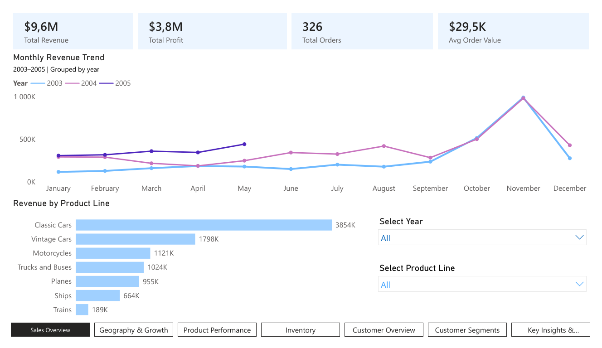
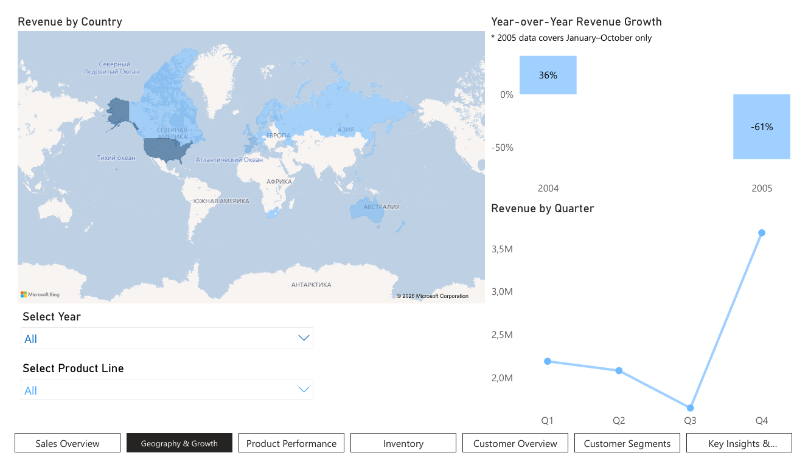
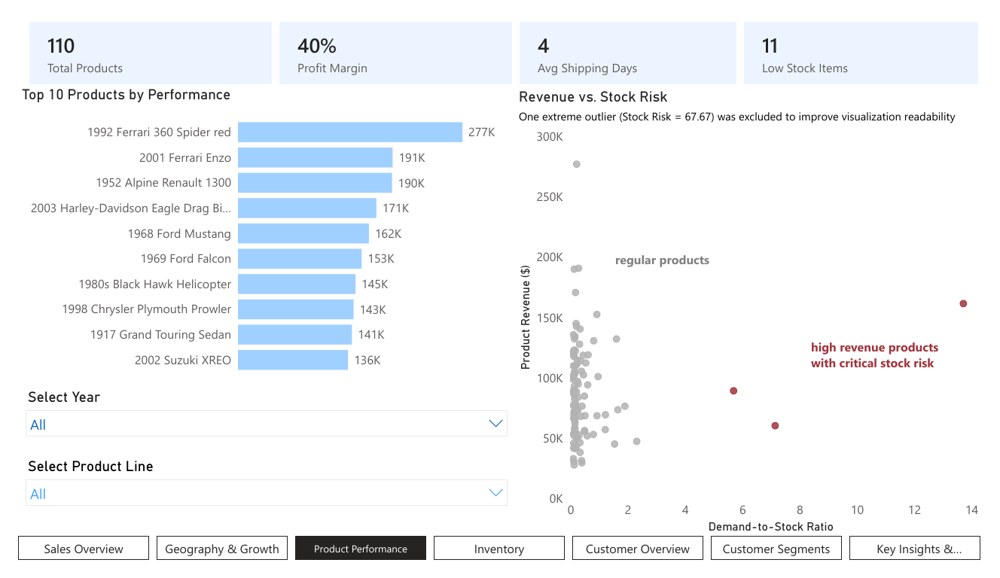
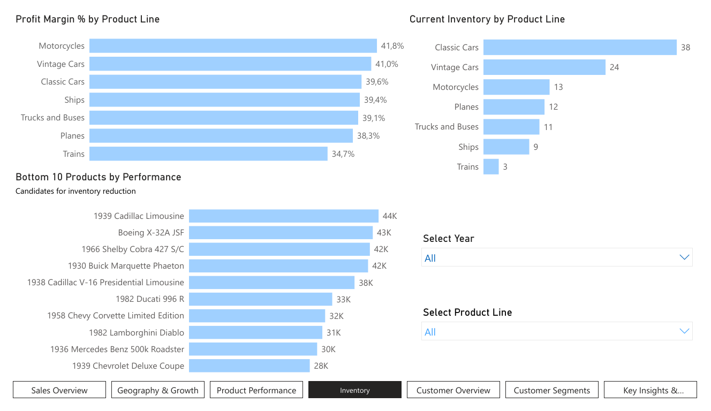
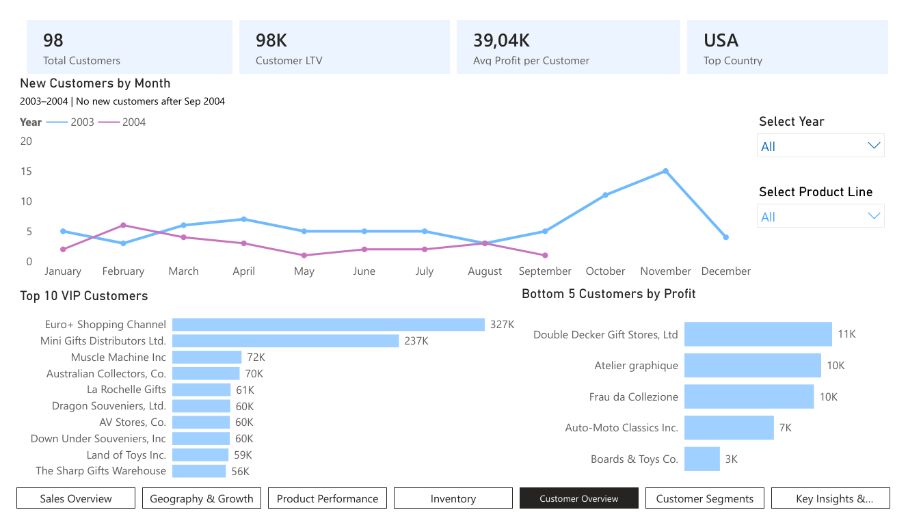
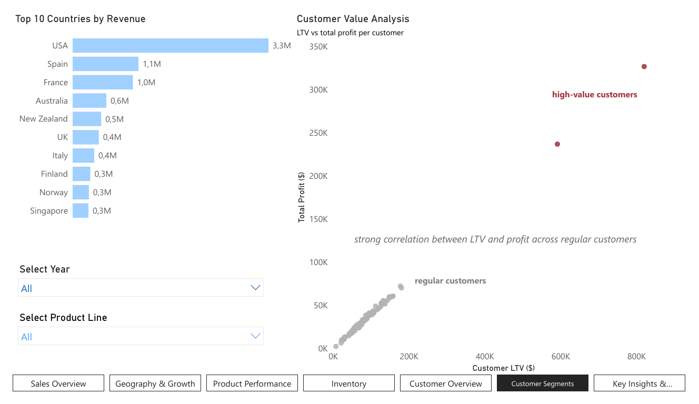
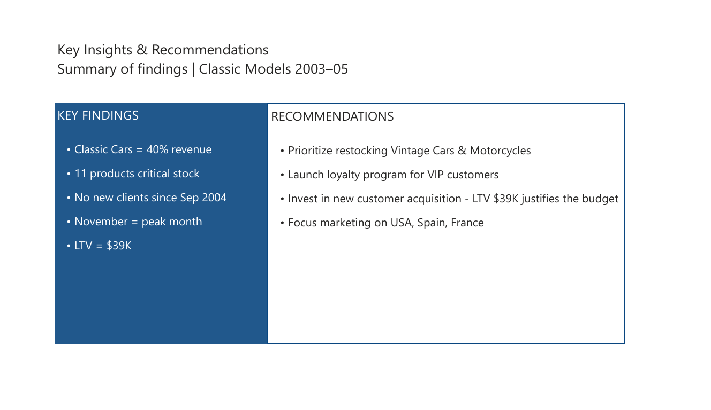

# Classic Models - Sales & Customer Analysis Dashboard

**Tools:** Power BI (Power Query, DAX, Data Modeling)

**Dataset:** [Classic Models — MySQL Sample Database](https://www.mysqltutorial.org/getting-started-with-mysql/mysql-sample-database/)

**Period:** 2003-2005

## Project Overview

The analysis is built around three core business questions:

1. **Which products should be ordered more or less?**
Inventory analysis combining stock risk and product performance to identify restocking priorities.

2. **How can marketing strategies be adapted to customer behavior?**
Customer segmentation into VIP and low-engagement groups to guide communication strategy.

3. **How much can we spend on acquiring new customers?**
Customer Lifetime Value (LTV) calculation to define a data-driven acquisition budget.

## Data Model

The report uses a Star Schema with 8 tables and a custom Date Table.

| Table | Records | Description |
|-------|--------:|-------------|
| **orders** | 326 | Customer orders with order dates and statuses |
| **orderdetails** | 2,996 | Order line items with products, quantities, and prices |
| **customers** | 122 | Customer profiles from 28 countries |
| **products** | 110 | Products with prices and inventory levels |
| **productlines** | 7 | Product categories |
| **payments** | 273 | Customer payment records |
| **employees** | 23 | Employees, sales representatives, and managers |
| **offices** | 7 | Company offices located in 7 cities |

Relationships: orders → customers, orderdetails → products → productlines, customers → employees → offices, orders → DateTable (active on orderDate)

## Data Preparation (Power Query)

- Removed `comments` column from orders (over 80% empty)

- Removed `addressLine2` from customers (sparse, no analytical value)

- Removed `textDescription` from productlines (free text, not used in analysis)

- Replaced NULL values in `state` with "N/A" for non-US customers

- Set correct data types: dates → Date, prices → Decimal Number

- Created calculated column `Revenue` in orderdetails: `quantityOrdered × priceEach`

- Created calculated column `Profit` in orderdetails: `quantityOrdered × (priceEach − buyPrice)`

- Created calculated column `ShippingDays` in orders: `shippedDate − orderDate`

## DAX Measures

| Measure | Formula / Purpose |
| --- | --- |
| **Total Revenue** | `SUMX` over the **Revenue** column in `orderdetails` |
| **Total Profit** | `SUMX` over the **Profit** column in `orderdetails` |
| **Total Orders** | `DISTINCTCOUNT(orderNumber)` |
| **Total Customers** | `DISTINCTCOUNT(customerNumber)` |
| **Avg Order Value** | `Total Revenue ÷ Total Orders` |
| **Profit Margin %** | `Total Profit ÷ Total Revenue` |
| **YTD Revenue** | `TOTALYTD(Total Revenue)` |
| **MTD Revenue** | `TOTALMTD(Total Revenue)` |
| **QTD Revenue** | `TOTALQTD(Total Revenue)` |
| **Revenue LY** | `CALCULATE(..., SAMEPERIODLASTYEAR(...))` |
| **Revenue Growth %** | `(Total Revenue − Revenue LY) ÷ Revenue LY` |
| **Customer LTV** | `Total Revenue ÷ Total Customers` |
| **Avg Profit per Customer** | `Total Profit ÷ Total Customers` |
| **Avg Shipping Days** | `AVERAGE(ShippingDays)` |
| **Low Stock Ratio** | `SUM(quantityOrdered) ÷ MAX(quantityInStock)` |
| **Low Stock Items** | Count of products where **Low Stock Ratio > 1** |
| **New Customers** | Customers placing their first order during the selected period |
| **Top Country** | Country with the highest **Total Revenue** |

## Dashboard Structure

**Page 1 - Sales Overview**
KPI cards: Total Revenue ($9.6M), Total Profit ($3.8M), Total Orders (326), Avg Order Value ($29.5K).
Monthly Revenue Trend and Revenue by Product Line.
*Classic Cars account for 40% of total revenue across all years.*

**Page 2 - Geography & Growth**
Revenue by Country (filled map), Year-over-Year Revenue Growth, Revenue by Quarter.
*Revenue grew 36% from 2003 to 2004. USA leads with $3.3M - 3x more than Spain in 2nd place.*
*Note: 2005 data covers January-October only.*

**Page 3 - Product Performance**
Top 10 Products by Performance and Stock Risk vs Revenue scatter chart.
*Three products identified as critical: high revenue but dangerously low stock levels.*

**Page 4 - Inventory Analysis**
Profit Margin % by Product Line, Inventory count, Bottom 10 Products by Performance.
*Motorcycles have the highest margin (41.8%). Trains show the weakest performance across all metrics.*

**Page 5 - Customer Overview**
New Customers by Month, Top 10 VIP and Bottom 5 Customers by Profit.
*No new customers acquired after September 2004 - a critical signal for marketing strategy.*

**Page 6 - Customer Segments**
Top 10 Countries by Revenue and Customer Value Analysis scatter chart.
*Euro+ Shopping Channel and Mini Gifts Distributors are clear outliers - VIP segment drives disproportionate profit.*

**Page 7 - Key Insights & Recommendations**
Summary of findings and actionable business recommendations.

## Key Findings

- **Classic Cars generate 40% of total revenue** - the most critical product line by far

- **11 products are at critical stock risk** - Vintage Cars and Motorcycles are top priority for restocking

- **Motorcycles have the highest profit margin (41.8%)** despite lower revenue than Classic Cars

- **November is the peak month** across all three years - critical period for inventory and staffing

- **Revenue grew 36% from 2003 to 2004** but declined 61% in 2005 (partial year, Jan–Oct only)

- **Euro+ Shopping Channel and Mini Gifts Distributors** are dominant VIP clients - classic Pareto effect where two customers generate a disproportionate share of profit

- **No new customers were acquired after September 2004** - urgent need for marketing investment

- **Customer LTV = $39K** - this defines the maximum reasonable budget per new customer acquisition

- **USA dominates revenue** ($3.3M vs $1.1M for Spain in 2nd place)

- **Average delivery time is 4 days** - consistent operational performance

## Business Recommendations

1. **Prioritize restocking Vintage Cars and Motorcycles** - high demand combined with low stock creates risk of lost sales

2. **Launch a VIP loyalty program** targeting Euro+ Shopping Channel and Mini Gifts Distributors to protect the most profitable relationships

3. **Run a re-engagement campaign** for bottom-tier customers - even modest improvement in low-engagement accounts would meaningfully impact total profit

4. **Invest in new customer acquisition** - LTV of $39K per customer justifies significant marketing spend; focus on Spain, France, and Australia as high-potential markets

5. **Plan inventory and staffing increases for October–November** to handle peak season demand without stockouts

6. **Review Trains product line** - lowest profit margin (34.7%) and smallest inventory (3 products); evaluate whether continued investment is justified
